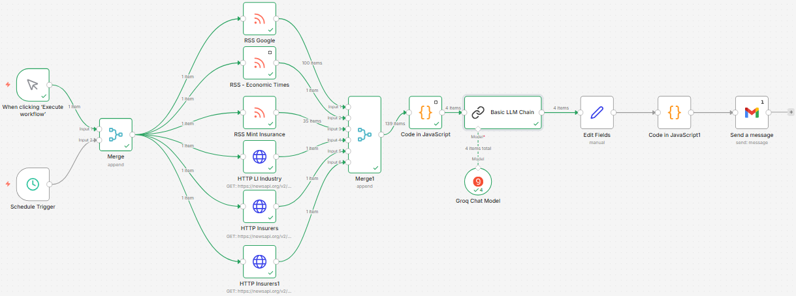
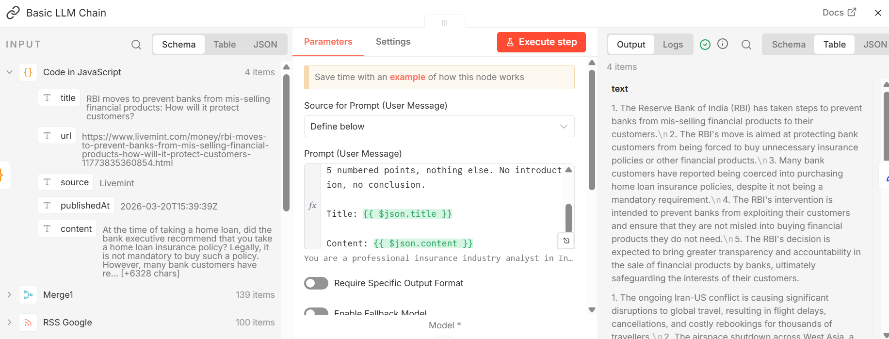
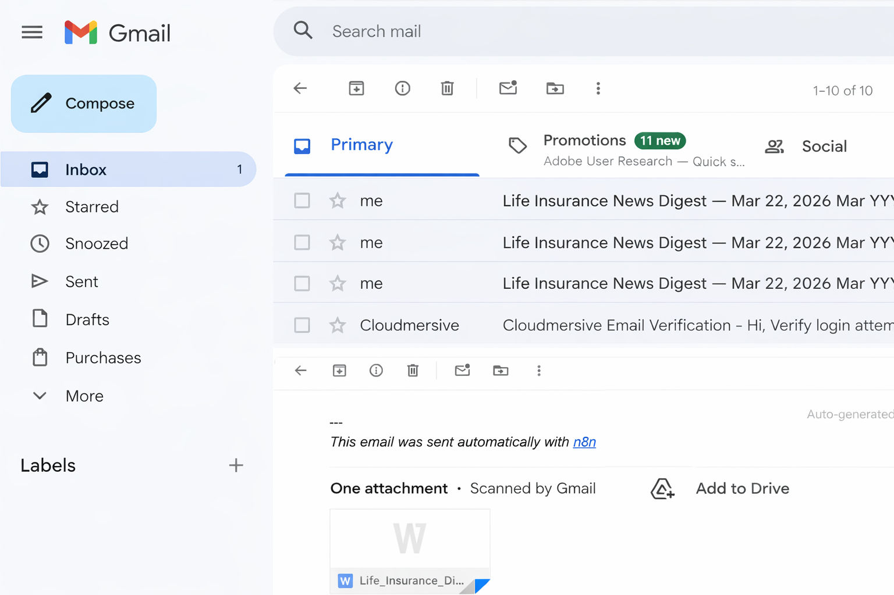
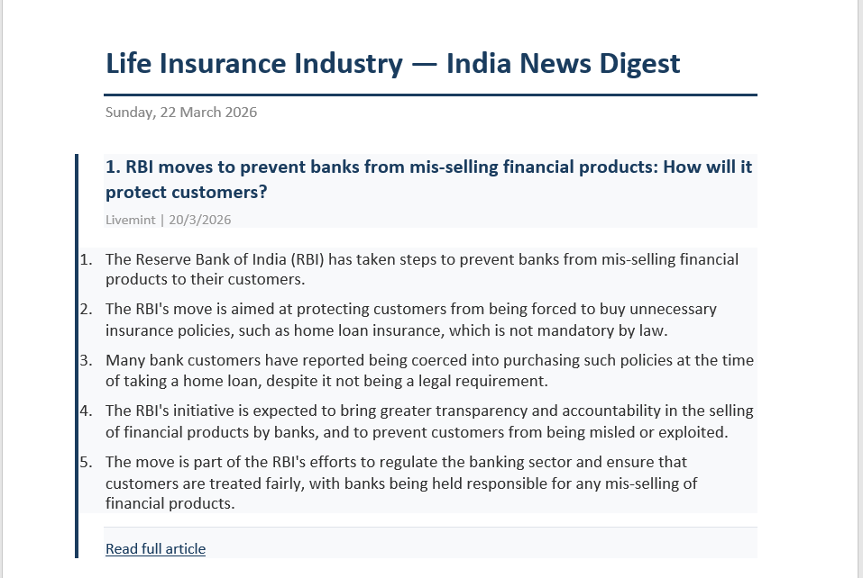

# 🗞️ Automated Industry Update
### AI-Powered Daily News Intelligence System | n8n + Groq AI + NewsAPI + Gmail

---


---

## 📌 Executive Summary

This project automates the daily task of manually searching, reading, and summarising 
news articles along specific industries as required news from India. What previously took **45–60 minutes of manual 
work every morning** now happens **automatically at 8:00 AM** — delivering a professionally 
formatted intelligence digest directly to my inbox with zero human intervention. It can also be triggered manually whenever required.

The system pulls news from **live sources**, filters for relevant content, uses 
**Groq's LLaMA 3.3 70B** to generate 5-point AI summaries per article, and delivers 
everything as a **formatted Word document** via Gmail with sources to the complete article.

> 💡 **Built entirely with free tools. Total running cost: ₹0 per day.**

---

## 🎯 Why I Built This

Working in **Sales Strategy & Analytics**, it was important to stay updated 
with the current changes in the Industry, market movements, competitor updates 
etc. I also made it a practice that I shared these updates to my team on a weekly basis to keep them updated as well. It was a manual, time-consuming activity.

The manual process was slow, inconsistent, and easy to skip on busy days. I needed 
something that ran whether or not I remembered to check the news.

### Before vs After

| | Before Automation | After Automation |
|---|---|---|
| ⏱️ Time spent | 45–60 minutes every morning | 0 minutes |
| 📰 Sources checked | 4–5 manually | 6 simultaneously |
| 🤖 Summarisation | Manual copy-paste into AI | Automated per article |
| 📄 Output | Scattered browser tabs | Single Word document in inbox |
| 🔁 Consistency | Depends on whether I remembered | Runs every day and when triggered |
| 💰 Cost | Only my time | ₹0 |

> This is not a demo project. I run this every day as part of my actual work.

---

## 📁 What's Included
```
Automated-Industry-Update/
│
├── 📄 README.md                    ← You are here
├── 📄 SECURITY.md                  ← Security policy
├── 📄 CONTRIBUTING.md              ← Contribution guidelines
├── 📄 LICENSE                      ← MIT License
├── 🔧 workflow.json                ← Complete n8n workflow (importable)
│
└──  📁 assets/
    ├── workflow-overview.png
    ├── workflow-detail.png
    ├── email-output.png
    ├── document-output.png
    └── node-config.png

```

---

## 🔄 Workflow Visualization

### Full Canvas


### Node Architecture
```
┌─────────────────────────────────────────────────────────────────────┐
│  TRIGGER LAYER                                                       │
│  [Manual Trigger] ──┐                                               │
│                     ├──► [Merge: Append]                            │
│  [Schedule: 8am] ───┘                                               │
└─────────────────────────────────────────────────────────────────────┘
                                 │
                                 ▼
┌─────────────────────────────────────────────────────────────────────┐
│  DATA LAYER — 6 Parallel Sources                                     │
│  [RSS: Google News] ──────┐                                         │
│  [RSS: Economic Times] ───┤                                         │
│  [RSS: Mint Insurance] ───┼──► [Merge1: Append] — All Combined     │
│  [NewsAPI: LI Industry] ──┤                                         │
│  [NewsAPI: Top Insurers] ─┤                                         │
│  [NewsAPI: IRDAI/Sector] ─┘                                         │
└─────────────────────────────────────────────────────────────────────┘
                                 │
                                 ▼
┌─────────────────────────────────────────────────────────────────────┐
│  PROCESSING LAYER                                                    │
│  [Code] → Deduplicate → Filter India keywords                       │
│         → Filter last 7 days → Sort newest → Limit 15              │
└─────────────────────────────────────────────────────────────────────┘
                                 │
                                 ▼
┌─────────────────────────────────────────────────────────────────────┐
│  AI LAYER                                                            │
│  [Basic LLM Chain] ──► [Groq: LLaMA 3.3 70B]                       │
│  Each article → 5-point professional summary                        │
└─────────────────────────────────────────────────────────────────────┘
                                 │
                                 ▼
┌─────────────────────────────────────────────────────────────────────┐
│  OUTPUT LAYER                                                        │
│  [Edit Fields] → Restore title + URL metadata                       │
│  [Code]        → Build formatted Word document                      │
│  [Gmail]       → Single email with .doc attachment                  │
└─────────────────────────────────────────────────────────────────────┘
```

### AI Node — Input and Output


### Sample Outputs

| Email Digest | Word Document |
|---|---|
|  |  |

---

## ⚙️ Methodology

### News Sources

| # | Source | Type | Coverage |
|---|---|---|---|
| 1 | Google News RSS | RSS | Broad Indian insurance news, real-time |
| 2 | Economic Times | RSS | Financial sector and insurance news |
| 3 | Mint Insurance | RSS | Premium financial journalism |
| 4 | NewsAPI — LI Industry | REST API | Life insurance industry keyword search |
| 5 | NewsAPI — Top Insurers | REST API | LIC, HDFC Life, ICICI Prudential, SBI Life |
| 6 | NewsAPI — IRDAI/Sector | REST API | Regulatory updates and sector news |

### Filtering Logic

Articles pass through three sequential filters:

**Filter 1 — India Relevance**
Must contain at least one keyword from a list of 26 terms including insurer names 
and regulatory terms (IRDAI, crore, lakh, rupee).

**Filter 2 — Date Range**
Only articles published in the last 7 days are included.

**Filter 3 — Deduplication**
Articles with identical titles from multiple sources are removed. 
The newest version is kept.

### AI Summarisation
```
Model:   Groq LLaMA 3.3 70B Versatile
Prompt:  You are a professional insurance industry analyst in India.
         Summarise the following news article in exactly 5 clear numbered points.
         Do not miss any key information.
         Each point must be one concise sentence.
         Return only the 5 numbered points, nothing else.

         Title: {{ article_title }}
         Content: {{ article_content }}
```

### Output Format Per Article
```
━━━━━━━━━━━━━━━━━━━━━━━━━━━━━━━━━━━━━━━━━━━
N. Full Article Title
Source Name  |  Publication Date

1. First key point.
2. Second key point.
3. Third key point.
4. Fourth key point.
5. Fifth key point.

🔗 Read full article: [URL]
━━━━━━━━━━━━━━━━━━━━━━━━━━━━━━━━━━━━━━━━━━━
```

---

## 📊 Results

| Metric | Value |
|---|---|
| ⏱️ Time saved per day | 45–60 minutes |
| 📰 Sources monitored simultaneously | 6 |
| 📄 Articles processed per run | Up to 15 (newest, India-relevant) |
| 🤖 AI model | Groq LLaMA 3.3 70B Versatile |
| 📁 Output format | Word document (.doc) via email |
| ⚡ Trigger options | Scheduled 8am daily + Manual on demand |
| 💰 Total daily cost | ₹0 |

---

## 🛠️ Tech Stack

| Tool | Role | Cost |
|---|---|---|
| [n8n](https://n8n.io) | Workflow automation (self-hosted via Docker) | Free |
| [NewsAPI](https://newsapi.org) | News article API | Free tier |
| [Google News RSS](https://news.google.com) | Live RSS news feed | Free |
| [Groq](https://console.groq.com) | LLM inference — LLaMA 3.3 70B | Free tier |
| [Gmail](https://gmail.com) | Email delivery | Free |
| [Docker Desktop](https://docker.com) | n8n hosting on Windows 11 | Free |

---

## 🚀 How to Use This

### Prerequisites

| Requirement | Where to Get |
|---|---|
| n8n (self-hosted or cloud) | [n8n.io](https://n8n.io) |
| NewsAPI key | [newsapi.org](https://newsapi.org) |
| Groq API key | [console.groq.com](https://console.groq.com) |
| Gmail with OAuth credentials | [console.cloud.google.com](https://console.cloud.google.com) |

### Import the Workflow
```bash
1. Download workflow.json from this repository
2. Open n8n at http://localhost:5678
3. Click + New Workflow
4. Click ··· menu (top right of canvas)
5. Click Import from file
6. Select workflow.json
```

### Add Your Credentials
```
NewsAPI key   → HTTP Request nodes → query parameter: apiKey
Groq API key  → Groq Chat Model node → Create new credential
Gmail OAuth   → Send a message node → Sign in with Google
```

### Activate
```
Click the Inactive toggle at top right of canvas
Toggle turns green → workflow runs every morning at 8:00 AM
```

### Customise for Your Industry

To adapt this for a different industry, update these two things:

1. **RSS and NewsAPI queries** — change the search terms in the HTTP Request and RSS nodes
2. **India keywords filter** — update the `indiaKeywords` array in Code in JavaScript

---

## 🔮 Next Steps

- [ ] Add additional RSS feeds for broader coverage
- [ ] Build a weekly trend summary from daily digests
- [ ] Add Telegram channel delivery option
- [ ] Flag articles mentioning specific regulatory changes automatically
- [ ] Build a Power BI dashboard tracking article volume and topics over time
- [ ] Add sentiment scoring to flag market-positive vs market-negative news

---

## 💡 Key Learnings

**Prompt constraints matter as much as instructions.**
Specifying the analyst persona, exact format, and "nothing else, no introduction, 
no conclusion" improved summary quality dramatically. Vague prompts produce vague output.

**Workflow architecture is the hard problem.**
The biggest challenge was not the AI integration — it was data aggregation. Multiple 
source nodes in n8n trigger separate execution threads. A second Merge node before 
the processing layer was the critical architectural fix that made single-email delivery 
work. I rebuilt this section five times before getting it right.

**Automations you actually use are the only ones that matter.**
The most valuable automations remove friction from tasks you already do every day. 
This has a 100% daily usage use case because it solves a real, daily pain point — 
not a hypothetical one. I go through this regularly, and there are times when I miss out. So, this solves that problem.

---

## 🔒 Security

See [SECURITY.md](SECURITY.md) for the security policy and responsible disclosure process.

---

## 👤 About

Built by someone working in the Strategy and Analytics — applying AI to make daily intelligence work faster, more consistent, 
and more comprehensive.

This project is part of a broader effort to document real-world AI applications 
in business and analytics.

---

## 📄 License

MIT License — see [LICENSE](LICENSE) for details.
Free to fork, adapt, and build on for your own industry.

---

<div align="center">

**Found this useful? Star the repository ⭐**

*Built with curiosity and a genuine hatred of repetitive manual work.*

</div>
